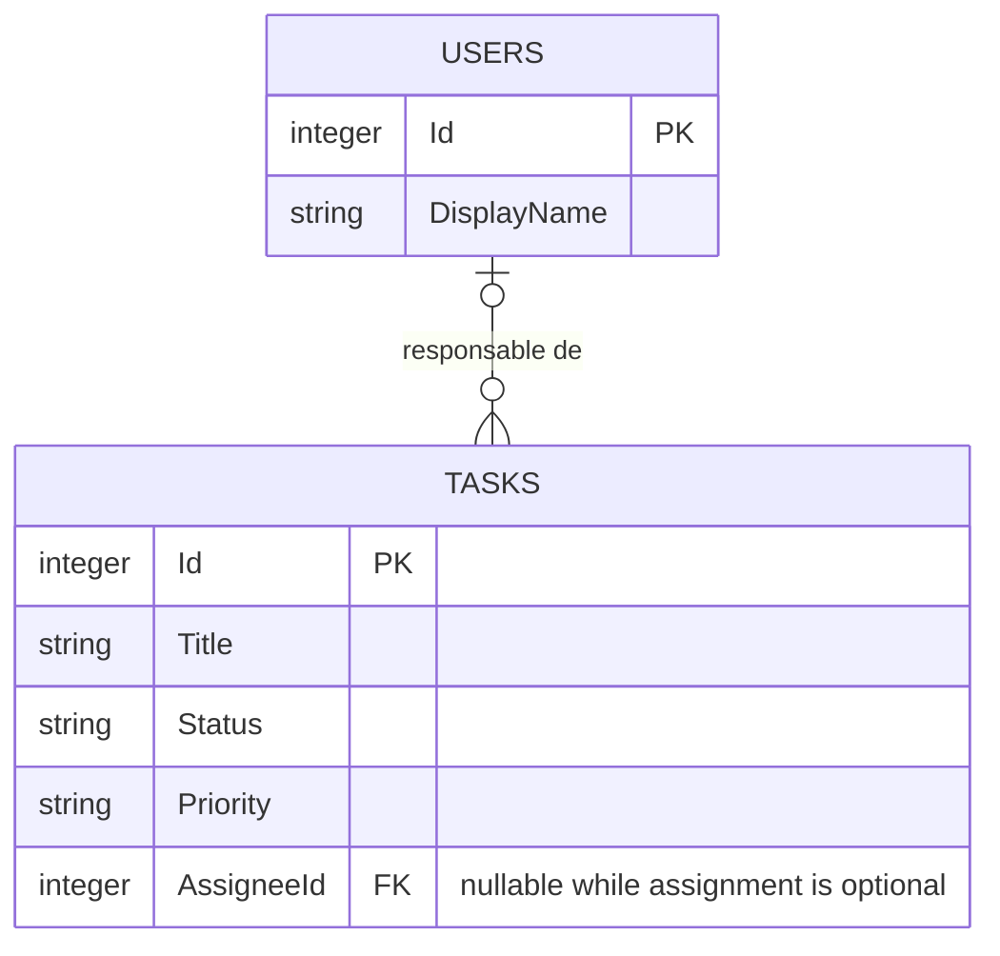
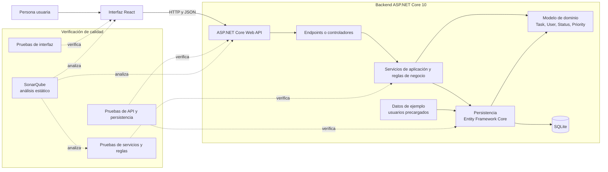

# Arquitectura y modelo de datos

> **Control documental**
> Código de proyecto: `app-todolist-260928`
> Fecha de actualización: `2026-09-28`
> Versión: `1`

## Estado del documento

Esta es una propuesta inicial basada en el [análisis del MVP](analisis.md) y el [plan del proyecto](plan-proyecto.md). Describe la arquitectura lógica, no una estructura de proyectos ya implementada. Se deberá revisar al cerrar las decisiones pendientes de la fase 0.

## Diagrama ERD

El modelo lógico mínimo contiene tareas y usuarios de ejemplo. Cada tarea puede tener cero o un responsable; un usuario puede ser responsable de cero o muchas tareas. La relación se muestra opcional porque el análisis todavía deja pendiente decidir si la asignación será obligatoria.

### Reglas del modelo

- `Status` representa los estados pendiente y completada.
- `Priority` representa los niveles baja, media y alta.
- `AssigneeId` referencia a `Users.Id`; será nullable si se decide que una tarea puede quedar sin asignar. Si la asignación se hace obligatoria, deberá ser no nullable.
- Los usuarios son registros de ejemplo precargados, no cuentas autenticadas.
- No se incluyen descripción, fechas, historial, credenciales ni pertenencia de tareas a cuentas, porque no forman parte del alcance acordado.
- Los tipos del diagrama son lógicos. La representación concreta de estados y prioridades en SQLite se decidirá al configurar Entity Framework Core.

## Diagrama de arquitectura

Las suites y frameworks concretos de pruebas siguen pendientes. El diagrama indica responsabilidades y límites de verificación, no obliga a crear un proyecto separado por cada bloque.

## Responsabilidades

| Componente | Responsabilidad |
|---|---|
| Interfaz React | Presentar el listado, formularios, filtros y acciones de tareas; comunicarse con la API. |
| ASP.NET Core Web API | Exponer los endpoints HTTP y traducir peticiones y respuestas. |
| Servicios de aplicación | Aplicar las reglas de negocio y coordinar operaciones de tareas. |
| Modelo de dominio | Representar tareas, usuarios de ejemplo, estados y prioridades. |
| Entity Framework Core | Persistir y consultar el modelo mediante SQLite. |
| Pruebas automatizadas | Verificar reglas, endpoints, persistencia e interacciones de interfaz según los frameworks elegidos. |
| SonarQube | Analizar estáticamente el código con las reglas acordadas; complementa, pero no sustituye, las pruebas. |

## Decisiones por cerrar

- Si `AssigneeId` será obligatorio o nullable.
- La representación de estado y prioridad en Entity Framework Core y SQLite.
- Los contratos concretos de la API y su estrategia de manejo de errores.
- La herramienta de construcción de React y los frameworks de pruebas.
- La configuración y reglas concretas de SonarQube.

## Documentos relacionados

- [README del proyecto](../README.md)
- [Análisis del MVP e historias de usuario](analisis.md)
- [Plan del proyecto](plan-proyecto.md)
