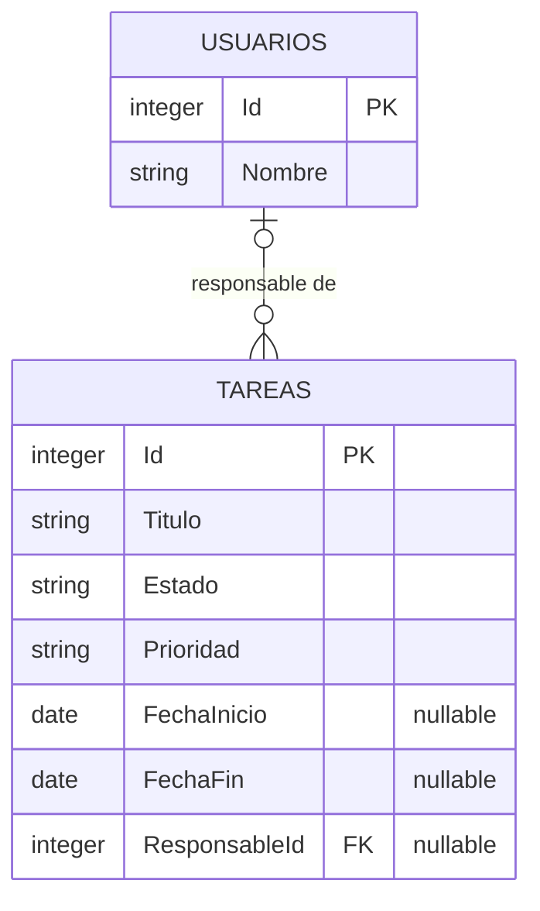
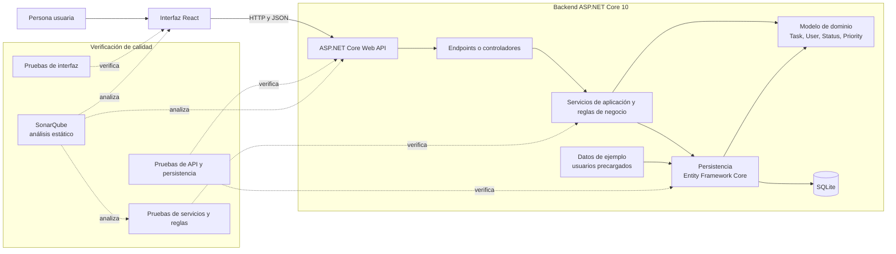

# Arquitectura y modelo de datos

> **Control documental**
> Código de proyecto: `app-todolist-260928`
> Fecha de actualización: `2026-09-29`
> Versión: `5`

## Estado del documento

La solución está implementada en `src/AppTodoList.Api` y `frontend`, con pruebas en `tests/AppTodoList.Tests` y `frontend/src`. Mantiene separadas API, servicio de aplicación, dominio y persistencia.

## Diagrama ERD

El modelo lógico mínimo contiene tareas y usuarios de ejemplo. Cada tarea puede tener cero o un responsable; un usuario puede ser responsable de cero o muchas tareas.

### Reglas del modelo

- `Status` representa los estados pendiente y completada.
- `Priority` representa los niveles baja, media y alta; una tarea nueva tendrá prioridad media por defecto.
- `AssigneeId` referencia a `Users.Id` y será nullable, porque la asignación es opcional.
- `FechaInicio` y `FechaFin` son fechas de calendario sin hora y ambas columnas son nullable. Se permiten ambas ausentes, solo inicio o ambas presentes cuando inicio sea anterior o igual al fin; no se permite fin sin inicio.
- La migración añade columnas nullable para conservar las tareas existentes sin asignarles fechas.
- Los usuarios son registros de ejemplo precargados, no cuentas autenticadas.
- No se incluyen descripción, fecha/hora, historial, credenciales ni pertenencia de tareas a cuentas, porque no forman parte del alcance acordado.
- Los estados y prioridades se almacenan como texto mediante conversiones de EF Core.
- EF Core aplica migraciones al iniciar la API; la migración inicial crea las tablas y precarga los usuarios de ejemplo.

## Diagrama de arquitectura

Las pruebas de backend usan xUnit; las de interfaz usan Vitest y React Testing Library. El diagrama indica responsabilidades y límites de verificación, no obliga a crear un proyecto separado por cada bloque.

## Responsabilidades

| Componente | Responsabilidad |
|---|---|
| Interfaz React | Presentar el listado, formularios, filtros y acciones de tareas; comunicarse con la API. |
| ASP.NET Core Web API | Exponer los endpoints HTTP y traducir peticiones y respuestas. |
| Servicios de aplicación | Aplicar las reglas de negocio y coordinar operaciones de tareas. |
| Modelo de dominio | Representar tareas, usuarios de ejemplo, estados y prioridades. |
| Entity Framework Core | Persistir y consultar el modelo mediante SQLite. |
| Pruebas automatizadas | Verificar reglas, endpoints, persistencia e interacciones de interfaz según los frameworks elegidos. |
| SonarQube | Analizar estáticamente el código con las reglas locales básicas previstas; configuración y ejecución pendientes. Complementa, pero no sustituye, las pruebas. |

## Contrato HTTP implementado

- `GET /api/tareas` admite el filtro opcional `estado` (`Pendiente` o `Completada`).
- `GET /api/tareas/{id}` consulta una tarea por identificador.
- `POST /api/tareas` crea; `PUT /api/tareas/{id}` edita título, prioridad, responsable y fechas opcionales de inicio/fin. La lectura y listado devuelven las fechas para presentar y rellenar el formulario de edición.
- `PUT /api/tareas/{id}/estado` completa o reabre; `DELETE /api/tareas/{id}` elimina.
- `GET /api/usuarios` devuelve los usuarios de ejemplo.
- Las entradas no válidas devuelven errores de validación HTTP 400; los identificadores inexistentes devuelven 404.

La prueba manual del flujo y la configuración/ejecución de SonarQube siguen pendientes. La implementación no implica que el MVP haya superado todavía la aceptación manual.

## Documentos relacionados

- [README del proyecto](../README.md)
- [Análisis del MVP e historias de usuario](analisis.md)
- [Plan del proyecto](plan-proyecto.md)
