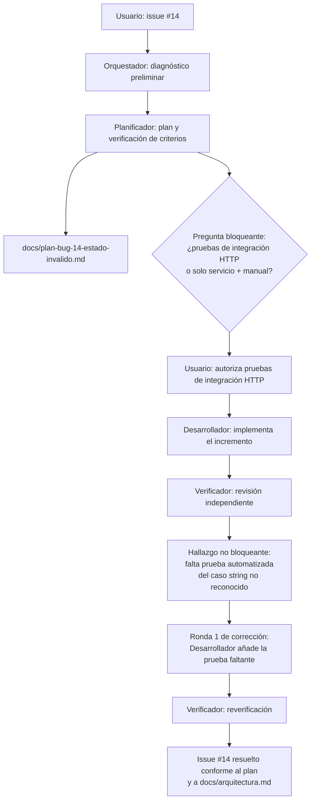

# Auditoría del flujo: bug #14 — La API devuelve 500 al cambiar una tarea a un estado no definido

> **Control documental**
> Código de proyecto: `app-todolist-260928`
> Fecha de actualización: `2026-09-29`
> Versión: `5`

## Registro cronológico

| # | Agente | Encargo recibido | Resultado entregado |
|---|---|---|---|
| 1 | Orquestador | Resolver el issue #14 ("La API devuelve 500 al cambiar una tarea a un estado no definido"). | Diagnóstico preliminar por exploración de código: el endpoint `PUT /api/tareas/{id}/estado` en [Program.cs](../src/AppTodoList.Api/Program.cs) no captura la `ArgumentException` que lanza `CambiarEstadoAsync` en [ServicioTareas.cs](../src/AppTodoList.Api/Aplicacion/ServicioTareas.cs), a diferencia de los demás endpoints de escritura. |
| 2 | Planificador | Confirmar el diagnóstico, revisar criterios de aceptación en `docs/analisis.md` y `docs/arquitectura.md`, definir el incremento mínimo y las pruebas necesarias; documentar el plan sin implementar. | Documento [docs/plan-bug-14-estado-invalido.md](plan-bug-14-estado-invalido.md) (versión 1). Confirma el diagnóstico. Identifica que `docs/arquitectura.md` ya exige HTTP 400 para entradas no válidas. Propone envolver la llamada del endpoint de estado en `try/catch` replicando el patrón existente, sin tocar el servicio ni el dominio. Señala un matiz a verificar en implementación (string no reconocido vs. entero fuera de rango del enum) y un gap: no existe infraestructura de pruebas de integración HTTP en el proyecto. Deja dos preguntas pendientes. |
| 3 | Usuario | Pregunta bloqueante trasladada por el Orquestador: ¿se autoriza añadir `Microsoft.AspNetCore.Mvc.Testing` y pruebas de integración HTTP? | Respuesta: **se autoriza**. El incremento incluirá pruebas de integración HTTP además de las de servicio. |
| 4 | Desarrollador | Implementar el incremento del plan: try/catch en el endpoint de estado, prueba de servicio, pruebas de integración HTTP (autorizadas), verificar el matiz string/entero y ejecutar `dotnet test`. | Modificados [Program.cs](../src/AppTodoList.Api/Program.cs) (try/catch añadido), [ServicioTareasTests.cs](../tests/AppTodoList.Tests/ServicioTareasTests.cs) (nueva prueba de servicio), [AppTodoList.Tests.csproj](../tests/AppTodoList.Tests/AppTodoList.Tests.csproj) (dependencia `Microsoft.AspNetCore.Mvc.Testing`) y nuevo archivo [EndpointsTareasTests.cs](../tests/AppTodoList.Tests/EndpointsTareasTests.cs) con prueba de integración HTTP contra `WebApplicationFactory<Program>` y SQLite en memoria aislada. Confirma que el caso "entero fuera de rango" producía el 500 y ahora produce 400; confirma que el caso "string no reconocido" ya devolvía 400 por fallo de model binding sin necesidad de cambios. Reporta `dotnet test`: 7 pruebas, 0 fallos. Indica que `docs/arquitectura.md` ya refleja el comportamiento verificado y no requiere cambios. |
| 5 | Verificador | Revisión independiente del diff, las pruebas nuevas, el aislamiento de la BD de integración, ejecución propia de `dotnet test` y coherencia documental. | Confirma el diff limpio y equivalente al patrón existente; confirma que ambas pruebas nuevas existen y ejercitan el caso descrito; confirma aislamiento de la BD de integración (SQLite en memoria, sin tocar `App_Data/tareas.db`, sin servidor externo); ejecuta `dotnet test` de forma independiente: 7 pruebas, 0 fallos; confirma que el alcance no tocó `ServicioTareas.cs`, `ContratosTarea.cs` ni `EstadoTarea.cs` y que la documentación sigue coherente. **Hallazgo no bloqueante**: la afirmación de que el caso "string no reconocido" ya devuelve 400 no tiene ninguna prueba automatizada que la respalde; recomienda añadir una prueba de integración para ese caso. Conclusión: issue resuelto conforme a los criterios verificables, con esta única limitación de cobertura. |
| 6 | Desarrollador (ronda 1 de corrección) | Añadir en `EndpointsTareasTests.cs` una prueba de integración HTTP que ejercite el caso "string no reconocido" (`{"estado": "Cancelada"}`) y verifique 400. | Añadida `CambiarEstado_ConStringNoReconocido_Devuelve400` en [EndpointsTareasTests.cs](../tests/AppTodoList.Tests/EndpointsTareasTests.cs). No se modificó ningún otro archivo. Reporta `dotnet test`: 8 pruebas, 0 fallos. |
| 7 | Verificador (reverificación ronda 1) | Confirmar de forma independiente que la nueva prueba existe, ejercita el escenario correcto, que no se tocó nada más, y ejecutar `dotnet test` de nuevo. | Confirma vía `git diff --stat` que el único cambio real de la ronda es la prueba añadida; confirma que el string `"Cancelada"` no es miembro del enum `EstadoTarea` y que la prueba comprueba 400; ejecuta `dotnet test` de forma independiente: 8 pruebas, 0 fallos, coincide con lo reportado. Conclusión: el hallazgo queda resuelto y el issue #14 puede considerarse resuelto en su totalidad conforme al plan y a `docs/arquitectura.md`. |

## Bloqueo resuelto

El plan dejó una decisión pendiente que no estaba documentada ni acordada previamente:

> ¿Se autoriza añadir la dependencia `Microsoft.AspNetCore.Mvc.Testing` y un primer archivo de pruebas de integración HTTP para verificar `PUT /api/tareas/{id}/estado` a nivel de endpoint, o se prefiere limitar la verificación de este incremento a pruebas de servicio más comprobación manual guiada (`AppTodoList.Api.http`)?

El usuario autorizó la opción de añadir pruebas de integración HTTP. El segundo punto del plan (confirmar en implementación si el caso "string no reconocido" ya devuelve 400) no era un bloqueo: era una verificación técnica, resuelta y ahora cubierta por prueba automatizada tras la ronda de corrección.

## Diagrama de flujo (definitivo)

## Conclusión final

El requisito cubierto es que `PUT /api/tareas/{id}/estado` devuelva `400 Bad Request` (en vez de `500`) ante un valor de estado no definido en el enum `EstadoTarea`, tanto cuando llega como entero fuera de rango (interceptado por el `try/catch` añadido en el endpoint, que delega en la validación ya existente de `ServicioTareas.CambiarEstadoAsync`) como cuando llega como string no reconocido (rechazado automáticamente por el model binding de minimal APIs antes de llegar al handler).

**Archivos modificados**: [Program.cs](../src/AppTodoList.Api/Program.cs), [ServicioTareasTests.cs](../tests/AppTodoList.Tests/ServicioTareasTests.cs), [AppTodoList.Tests.csproj](../tests/AppTodoList.Tests/AppTodoList.Tests.csproj) y el nuevo [EndpointsTareasTests.cs](../tests/AppTodoList.Tests/EndpointsTareasTests.cs).

**Pruebas ejecutadas y verificadas de forma independiente por el Verificador**: `dotnet test` — 8 pruebas totales, 0 fallos (incluye la suite previa, la prueba de servicio para el entero fuera de rango, y las dos pruebas de integración HTTP para entero fuera de rango y string no reconocido).

**Documentación funcional**: `docs/arquitectura.md` ya declaraba el criterio de aceptación (400 para entradas no válidas) y no requirió modificación, porque el comportamiento implementado pasa a cumplirlo; no se detectaron discrepancias en `docs/analisis.md`.

**Limitaciones o decisiones pendientes**: ninguna sobre este bug concreto. El comportamiento preexistente de `ServicioTareas.CambiarEstadoAsync` (validar el estado antes de comprobar si el `id` existe, por lo que un `id` inexistente combinado con un estado inválido devuelve 400 en vez de 404) fue señalado por el Verificador como fuera del alcance de este plan y no como una regresión; no se ha tocado ni evaluado como parte de este issue.

Este documento de auditoría registra el proceso seguido y no sustituye el cierre del issue en GitHub ni la decisión final del usuario sobre darlo por cerrado.

