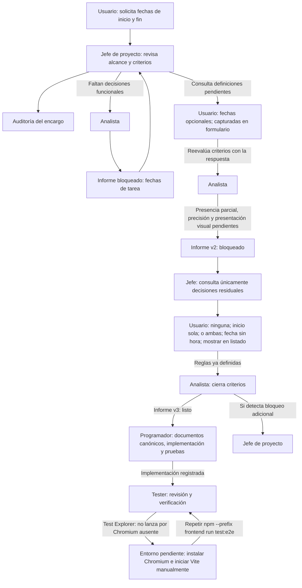

# Auditoría del flujo general: fechas de inicio y fin de las tareas

> **Control documental**
> Código de proyecto: `app-todolist-260928`
> Fecha de actualización: `2026-09-29`
> Versión: `15`

## Registro cronológico

| # | Agente | Encargo recibido | Actuación y resultado |
|---|---|---|---|
| 1 | Jefe de proyecto | El usuario solicita incorporar fechas de inicio y fin a las tareas, indicando que la fecha de inicio no puede ser posterior a la fecha de fin. | Se revisaron `docs/analisis.md` y `docs/plan-proyecto.md`. El análisis vigente limita las tareas a título, estado, prioridad y responsable opcional, y excluye expresamente la fecha de vencimiento; no define fechas de inicio/fin, su nulabilidad ni sus criterios de aceptación. La regla `inicio <= fin` sí está definida por el usuario. Se elige la vía de análisis previo por faltar definición funcional. Auditoría creada en versión 1; siguiente traspaso: Analista. |
| 2 | Analista funcional | Contrastar el comportamiento real y definir criterios para fechas de inicio y fin; entregar al Programador si no faltan decisiones de producto. | Se revisaron `docs/analisis.md`, `docs/arquitectura.md`, `docs/manual-usuario.md`, el dominio, contratos y servicio de tareas, el mapeo EF Core, los endpoints, tipos y pantalla React, y pruebas existentes. Se creó `docs/analisis-encargo-fechas-tarea.md` en versión 1. La regla `inicio <= fin` y la aceptación de igualdad quedan definidas; quedan bloqueantes obligatoriedad/emparejamiento, fecha frente a instante y precisión, superficies de captura/consulta, y tratamiento de tareas existentes. Estado: `bloqueado`; no se delega al Programador. Se devuelve al Jefe para obtener decisión del usuario. |
| 3 | Jefe de proyecto | Recibir el resultado bloqueado del Analista y decidir el siguiente paso del flujo. | Se confirma que la regla `inicio <= fin` permite igualdad, pero las cuatro decisiones funcionales del informe impiden una implementación sin inventar alcance. No se asigna al Programador. El flujo queda bloqueado a la espera de respuesta del usuario; la auditoría pasa a versión 3. |
| 4 | Jefe de proyecto | Incorporar la respuesta del usuario: las fechas son opcionales y se capturan en el formulario; reevaluar si puede continuar el flujo. | Se registra como resuelta la opcionalidad general y como superficie de captura el formulario. Se solicita al Analista reevaluar si esto define la opcionalidad independiente/pareada, las superficies de consulta, y el tratamiento de datos existentes; también debe identificar si la precisión temporal sigue requiriendo decisión. La auditoría pasa a versión 4; siguiente traspaso: Analista. |
| 5 | Analista funcional | Reevaluar el informe con la respuesta «fechas opcionales, se capturan en el formulario». | Se actualiza `docs/analisis-encargo-fechas-tarea.md` a versión 2. Se consideran resueltos la opcionalidad general, la captura en el formulario de creación/edición y el tratamiento de tareas existentes: la ausencia de ambas fechas es válida y no deben inventarse valores. El flujo actual implica que la lectura API usada para rellenar la edición devuelva los valores; no implica mostrarlos visualmente en el listado. Siguen bloqueando la regla para presencia parcial, la precisión fecha/hora y la presentación visual en superficies de lectura. Estado: `bloqueado`; no se delega código. Se devuelve al Jefe de proyecto para obtener solo esas decisiones. La auditoría pasa a versión 5. |
| 6 | Jefe de proyecto | Recibir la reevaluación y preparar el siguiente paso del encargo. | Se acepta el análisis v2: opcionalidad, captura en creación/edición y ausencia válida de fechas en tareas existentes quedan definidas. Se solicita al usuario resolver únicamente presencia parcial, precisión temporal y presentación visual en lectura. Estado: `bloqueado`; no hay traspaso al Programador. La auditoría pasa a versión 6. |
| 7 | Jefe de proyecto | Incorporar la respuesta del usuario sobre presencia, formato y presentación de las fechas. | Queda definido: ninguna fecha es válido; inicio sin fin también es válido; fecha de fin sin inicio no es válida; ambas fechas son de calendario, sin hora; se muestran en el formulario y en el listado. Se solicita al Analista actualizar los criterios con estas reglas y traspasar al Programador si no quedan bloqueos. La auditoría pasa a versión 7; siguiente traspaso: Analista. |
| 8 | Analista funcional | Actualizar el informe con las reglas decididas y determinar si el encargo está listo para implementación. | Se actualiza `docs/analisis-encargo-fechas-tarea.md` a versión 3. Se especifican las cuatro combinaciones de presencia, el orden `inicio <= fin` con igualdad permitida, fechas de calendario sin hora, captura en creación/edición, lectura para rellenar edición, visualización en listado y conservación de tareas existentes sin fechas. No quedan decisiones funcionales bloqueantes. Estado: `listo`; se encarga al Programador actualizar primero los documentos canónicos afectados, implementar y probar conforme al informe. No se ejecutaron comandos ni pruebas. La auditoría pasa a versión 8. |
| 9 | Jefe de proyecto | Recibir el informe listo del Analista y confirmar el inicio de implementación. | Se confirma el traspaso al Programador con `docs/analisis-encargo-fechas-tarea.md` v3 y esta auditoría. El encargo entra en curso; el Programador debe actualizar primero los documentos canónicos afectados, implementar y añadir pruebas según CA-01 a CA-07. Aún no hay evidencia de implementación o validación. La auditoría pasa a versión 9. |
| 10 | Programador | Implementar fechas de inicio y fin conforme al informe v3 y registrar resultados para el Tester. | Se actualizan primero los documentos canónicos; se añaden fechas `DateOnly?`, validación de presencia y orden, migración SQLite nullable, contratos de lectura/escritura y controles de formulario/listado/edición. Se agregan pruebas de reglas, migración de datos antiguos, API/persistencia y React. Verificaciones: 15 pruebas xUnit y 8 Vitest aprobadas; build frontend aprobado; diagnósticos sin errores; `git diff --check` limpio. El intento del E2E no pudo iniciar porque falta Chromium de Playwright. No se inició aplicación ni se modificó la base local. Siguiente etapa: Tester. La auditoría pasa a versión 10. |
| 11 | Jefe de proyecto | Recibir la entrega del Programador, actualizar el estado de seguimiento y confirmar el siguiente rol. | Se verifica en la auditoría la implementación, los documentos actualizados y los resultados comunicados: xUnit 15/15, Vitest 8/8, build y `git diff --check` aprobados. E2E sigue bloqueado por Chromium ausente y la prueba manual está pendiente. Se actualiza el cuadro de mando a versión 7; siguiente etapa: Tester. La auditoría pasa a versión 11. |
| 12 | Jefe de proyecto | Revisar la captura compartida del Test Explorer y precisar el estado de Playwright. | `testFailure` confirma que `tareas.spec.ts` falló al lanzar Chromium: falta `C:\Users\hispa\AppData\Local\ms-playwright\chromium_headless_shell-1243\chrome-headless-shell-win64\chrome-headless-shell.exe`. El escenario no alcanzó a ejecutarse; no hay evidencia de fallo funcional de la prueba. `frontend/playwright.config.ts` requiere `http://localhost:5173` y no arranca un servidor; `.github/agents/tester.agent.md` indica que Vite debe iniciarse manualmente y Chromium estar instalado. La invocación del agente Tester no está permitida en esta sesión, así que no se afirma una verificación suya. El proceso no está finalizado: E2E y validación manual pendientes. La auditoría pasa a versión 12. |
| 13 | Jefe de proyecto | Instalar Chromium a petición del usuario y comprobar si quedó disponible tras el error de Test Explorer. | `npm --prefix frontend exec -- playwright install chromium` agotó los timeouts predeterminados del CDN. El reintento con `PLAYWRIGHT_DOWNLOAD_CONNECTION_TIMEOUT=120000` también agotó cinco intentos de 120 segundos contra `cdn.playwright.dev`; no se instaló el navegador requerido. `npm --prefix frontend exec -- playwright install --list` informa que el proyecto usa Playwright 1.63.0 y no tiene Chromium v1243; solo aparecen Chromium 1187 y 1228 referenciados por otros proyectos/versiones. No se modificó configuración para forzar un navegador incompatible. E2E permanece bloqueado por conectividad de descarga; Vite manual y aceptación manual siguen pendientes. La auditoría pasa a versión 13. |
| 14 | Jefe de proyecto | Verificar la instalación de Chromium hecha por el usuario en otra sesión y preparar la ejecución E2E. | `npm --prefix frontend exec -- playwright install --list` ya muestra Chromium v1243 y `chromium_headless_shell-1243` bajo Playwright 1.63.0; ambos ejecutables existen en la caché (`chrome.exe` y `chrome-headless-shell.exe`). El prerrequisito de navegador queda resuelto. La comprobación de `http://localhost:5173` indica que Vite no está en marcha; la config Playwright no arranca servidor, por lo que el E2E aún no puede ejecutarse. Falta que el usuario inicie Vite manualmente; el Jefe podrá ejecutar entonces el E2E. La auditoría pasa a versión 14. |
| 15 | Jefe de proyecto | Ejecutar el E2E tras iniciar el usuario Vite con Dev Launcher. | Con Vite respondiendo 200 en `http://localhost:5173`, `npm --prefix frontend run test:e2e` ejecutó el escenario `crea, completa y filtra una tarea`: 1 pasada en Chromium (~4,7 s). Todas las suites automatizadas quedan en verde: 15 xUnit, 8 Vitest y 1 E2E. Queda pendiente únicamente la prueba manual guiada de aceptación, a cargo del usuario. La auditoría pasa a versión 15. |

## Fuentes iniciales y estado comprobado

- `docs/analisis.md`, versión 6, secciones 4, 6, 9 y 11: alcance y requisitos actuales; no contempla fechas de inicio/fin y mantiene explícitamente fuera del MVP la fecha de vencimiento.
- `docs/plan-proyecto.md`, versión 4: fase 6 continúa pendiente de validación manual y análisis SonarQube.
- `docs/plan-agentes.md`, versión 18: define la ruta de análisis funcional antes de implementación cuando faltan reglas o criterios.
- Repositorio verificado con `git remote -v`: `hispafox/app-todolist-260928`.
- `git log --oneline -15`: rama `main`, `HEAD` en `a7afd85` (`origin/main`).
- `git status --short`: existe un cambio local previo en `.devlauncher/profiles/app-todolist-260928.json`; queda fuera de este encargo y se preserva.
- `dotnet test AppTodoList.sln --no-restore --logger "console;verbosity=minimal"`: 8 pruebas, 8 correctas, 0 fallidas.
- `npm --prefix frontend test`: 4 pruebas, 4 correctas, 0 fallidas.
- No se consultó GitHub en esta sesión: la herramienta `get_me`, requerida antes de las consultas de GitHub, no está disponible. La situación de issues y pull requests queda sin refrescar.

## Vía y justificación

La solicitud añade campos de tarea que el alcance canónico excluye o no especifica. Aunque el usuario fijó la invariante de orden, no se ha determinado si las fechas son opcionales, qué comportamiento se espera al editarlas ni qué superficies de consulta deben mostrarlas. Se encarga primero al Analista para concretar el comportamiento y los criterios observables; el informe determinará si procede traspaso al Programador o si hay que pedir una decisión al usuario.

El Jefe de proyecto no implementa código ni modifica la documentación funcional canónica. La actualización de `docs/analisis.md` corresponde al flujo posterior autorizado si el análisis confirma un cambio de alcance.

## Diagrama del flujo

## Pendientes al cierre de la versión 10

- Tester: verificar CA-01 a CA-07 con las rutas de informe y auditoría indicadas abajo. El recorrido manual y el E2E de navegador siguen pendientes; el E2E requiere instalar Chromium.
- Jefe de proyecto: actualizar el cuadro de mando; el Programador no lo modifica.
- Actualizar la situación de GitHub cuando la herramienta requerida esté disponible.

## Resultado de la primera intervención del Analista (versión 2 de la auditoría)

- **Fuentes comprobadas:** `docs/analisis.md` (RF-01, RF-02, RF-03, RF-09, HU-01, HU-02, HU-03, HU-09 y decisión de alcance), `docs/arquitectura.md`, `docs/manual-usuario.md`, `src/AppTodoList.Api/Dominio/Tarea.cs`, `src/AppTodoList.Api/Aplicacion/ContratosTarea.cs`, `src/AppTodoList.Api/Aplicacion/ServicioTareas.cs`, `src/AppTodoList.Api/Persistencia/ListaTareasDbContext.cs`, `src/AppTodoList.Api/Program.cs`, `frontend/src/types.ts`, `frontend/src/App.tsx` y pruebas de servicio/API.
- **Hallazgo:** el código no contiene fechas en entidad, contratos, validación, formulario ni listado. La API aplica migraciones EF Core al inicio. No se comprobó la base local ni se ejecutaron pruebas/comandos.
- **Informe:** `docs/analisis-encargo-fechas-tarea.md`, versión 1.
- **Estado actual:** `bloqueado`. La regla `inicio <= fin` está determinada, pero antes de programar el usuario debe decidir obligatoriedad y si los valores opcionales pueden ser parciales, precisión temporal, superficies a exponer y tratamiento de tareas preexistentes. La solicitud de respuesta al usuario queda a cargo del Jefe.
- **Traspaso:** devuelto al Jefe de proyecto con las rutas de esta auditoría y del informe. No se encarga implementación al Programador; una respuesta del usuario deberá registrarse aquí antes de autorizar la siguiente etapa.

## Estado del flujo al cierre de la versión 4

**Pendiente de reevaluación funcional.** El usuario había aclarado que las fechas son opcionales y se capturan en el formulario. En ese momento no había traspaso al Programador ni cambios de código; la siguiente actuación era del Analista.

## Resultado de la segunda intervención del Analista

- **Fuentes comprobadas:** respuesta del usuario; `docs/analisis.md` (RF-01, RF-02, RF-03, RF-09, HU-01, HU-02, HU-03, HU-09 y límites del MVP); `docs/arquitectura.md`; `docs/manual-usuario.md`; `src/AppTodoList.Api/Aplicacion/ContratosTarea.cs`; `frontend/src/App.tsx`; `frontend/src/types.ts`; e informe del encargo v1.
- **Hallazgos:** la interfaz actual tiene un único formulario usado para crear y editar, mientras que el listado presenta título, estado, prioridad y responsable; la edición se inicia con la tarea ya cargada. Las respuestas de tarea existentes no contemplan fechas. Por ello, la lectura API que alimenta el formulario debe devolverlas para conservarlas al editar, pero la respuesta «capturadas en el formulario» no implica que se muestren visualmente en el listado. «Opcionales» resuelve que ambas pueden quedar ausentes; no se presume si se permite una sola o solo ambas juntas.
- **Tareas existentes:** su ausencia de fechas se admite como válida bajo la opcionalidad confirmada; no se deben fabricar valores. No se comprobó la base local ni se ejecutaron comandos o pruebas.
- **Informe:** `docs/analisis-encargo-fechas-tarea.md`, versión 2.
- **Estado actual:** `bloqueado` por tres decisiones: tratamiento de presencia parcial; representación y precisión fecha/hora; presentación visual en el listado u otra superficie de lectura. La lectura API necesaria para rellenar la edición se deriva del flujo existente. La igualdad sigue permitida por `inicio <= fin`.
- **Traspaso:** devuelto al Jefe de proyecto con ambas rutas: esta auditoría y el informe. No se delega implementación ni pruebas al Programador.

## Estado actual del flujo

**No finalizado; falta solo la aceptación manual.** Todas las pruebas automatizadas están en verde: 15 xUnit, 8 Vitest y 1 E2E de Playwright (`crea, completa y filtra una tarea`, aprobado en Chromium v1243 con Vite en `http://localhost:5173`). El build de producción del frontend también pasa. El único paso restante para cerrar el encargo es la prueba manual guiada de aceptación, a cargo del usuario. El agente Tester no está disponible para invocación en esta sesión.

## Resultado de la tercera intervención del Analista

- **Fuentes consultadas:** respuestas del usuario; `docs/analisis-encargo-fechas-tarea.md` v2; `docs/analisis.md` (RF-01, RF-02, RF-03, RF-09 y alcance); código actual de `frontend/src/App.tsx` y `src/AppTodoList.Api/Aplicacion/ContratosTarea.cs`; hallazgos de código ya registrados en las intervenciones previas de esta auditoría.
- **Hallazgo funcional:** las reglas cierran todos los casos: ambas ausentes, solo inicio, inicio y fin con inicio menor o igual al fin son válidos; solo fin y comienzo posterior al fin son inválidos. Se aceptan fechas de calendario sin hora, capturadas en creación/edición y mostradas en el listado. La lectura usada para rellenar la edición debe devolver los campos.
- **Hallazgo de situación actual:** el contrato de respuesta y la interfaz inspeccionados todavía no contienen fechas; el formulario de edición se rellena a partir de la tarea cargada desde el listado. Las tareas persistidas sin fechas deben conservar esa ausencia y no recibir valores inventados.
- **Informe:** `docs/analisis-encargo-fechas-tarea.md`, versión 3.
- **Estado:** `listo`; no quedan decisiones funcionales bloqueantes. No se inspeccionó la base de datos local.
- **Traspaso al Programador:** actualizar primero los documentos canónicos afectados y luego implementar y probar ambas fechas. Cubrir todas las combinaciones presencia/ausencia, igualdad permitida, inicio posterior a fin rechazado, lectura/edición, listado y registros existentes sin fechas. Límites: no fecha/hora, filtrado, ordenación, calendario, recordatorios ni asignación de fechas inventadas.
- **Verificación de esta intervención:** no se ejecutaron comandos ni pruebas.

## Resultado de la intervención del Programador

- **Requisito implementado:** fechas de calendario sin hora, con ambas ausentes, solo inicio o ambas cuando inicio sea igual o anterior al fin. Se rechazan fin sin inicio e inicio posterior al fin. Las fechas se capturan al crear/editar, se devuelven en lectura y se muestran en el listado; las fechas antiguas permanecen ausentes.
- **Documentación canónica actualizada antes del código:** `README.md` v10, `docs/analisis.md` v7, `docs/arquitectura.md` v5, `docs/manual-usuario.md` v6 y `docs/plan-proyecto.md` v5.
- **Archivos de implementación y pruebas:** `src/AppTodoList.Api/Dominio/Tarea.cs`; `src/AppTodoList.Api/Aplicacion/ContratosTarea.cs`; `src/AppTodoList.Api/Aplicacion/ServicioTareas.cs`; `src/AppTodoList.Api/Persistencia/ListaTareasDbContext.cs`; migración `20260929112010_FechasInicioFin` y snapshot; `frontend/src/types.ts`, `frontend/src/api.ts`, `frontend/src/App.tsx`, `frontend/src/styles.css`; `tests/AppTodoList.Tests/ServicioTareasTests.cs`, `tests/AppTodoList.Tests/EndpointsTareasTests.cs` y `frontend/src/App.test.tsx`.
- **Comandos y resultados:** `dotnet ef --version` informó 10.0.12; `dotnet ef migrations add FechasInicioFin --project src/AppTodoList.Api --startup-project src/AppTodoList.Api` compiló correctamente y generó columnas `TEXT NULL`; `dotnet test AppTodoList.sln --no-restore --logger "console;verbosity=minimal"` aprobó 15/15; `npm --prefix frontend test` aprobó 8/8; `npm --prefix frontend run build` terminó correctamente; `git diff --check` no informó errores. Los diagnósticos de los archivos cambiados no informaron errores.
- **E2E y limitaciones:** el intento de ejecutar la suite completa informó que no existe el ejecutable Chromium requerido en la caché de Playwright. No se descargó el navegador. No se inició ninguna aplicación/servidor y no se abrió ni modificó la base SQLite local. Falta la validación manual de aceptación.
- **Siguiente etapa:** Tester. **Informe:** `docs/analisis-encargo-fechas-tarea.md` versión 3. **Auditoría:** este documento versión 10. **Criterios:** CA-01 a CA-07 del informe. **Estado de comprobación:** backend y frontend automatizados aprobados; build aprobada; E2E y recorrido manual pendientes por las limitaciones anteriores.

## Resultado de la intervención del Jefe de proyecto

- **Revisión del estado:** el registro del Programador confirma cambios de documentación, API, persistencia/migración, frontend y pruebas; el árbol de trabajo refleja dichos cambios locales.
- **Verificaciones registradas por el Programador:** `dotnet test AppTodoList.sln --no-restore --logger "console;verbosity=minimal"` (15/15); `npm --prefix frontend test` (8/8); `npm --prefix frontend run build` y `git diff --check` correctos.
- **Pendiente:** el E2E de Playwright no inició por no estar Chromium disponible; falta la validación manual de aceptación. No se consideran verificados esos criterios.
- **Seguimiento:** el cuadro de mando se actualiza a versión 7. El siguiente traspaso corresponde al Tester con CA-01 a CA-07 del informe v3.

## Resultado de la evidencia compartida por el usuario

- **Origen:** captura del Explorador de Pruebas y detalle obtenido con `testFailure` en esta sesión.
- **Resultado observado:** 15 de 16 pruebas en el Explorador; el caso `frontend/e2e/tareas.spec.ts` (`crea, completa y filtra una tarea`) termina en 10 ms con error `browserType.launch`: no existe `C:\Users\hispa\AppData\Local\ms-playwright\chromium_headless_shell-1243\chrome-headless-shell-win64\chrome-headless-shell.exe` en la caché local indicada por Playwright.
- **Interpretación:** el navegador no arranca y el cuerpo del caso E2E no se ejecuta. Se registra como fallo de inicialización/prerrequisito, no como fallo de una aserción funcional. El E2E permanece sin validar.
- **Prerrequisitos confirmados:** el script local es `npm --prefix frontend run test:e2e`; `frontend/playwright.config.ts` usa `baseURL: http://localhost:5173` sin configuración que arranque `webServer`; el perfil Tester requiere Chromium instalado y Vite iniciado manualmente.
- **Limitación de flujo:** no se pudo invocar al agente Tester desde el perfil actual; esta entrada la registra el Jefe a partir de evidencia compartida y de la lectura del error, no sustituye una revisión completa del Tester.
- **Siguiente acción:** disponer Chromium mediante la instalación de navegadores de Playwright, iniciar Vite manualmente según las instrucciones locales y repetir el comando E2E. Completar también la prueba manual. Hasta entonces no se pasa a QA ni se cierra el proceso.

## Resultado de los intentos de instalación

- **A petición del usuario:** se intentó instalar Chromium usando el CLI de Playwright incluido en `frontend`.
- **Comandos:** `npm --prefix frontend exec -- playwright install chromium`; reintento con `PLAYWRIGHT_DOWNLOAD_CONNECTION_TIMEOUT=120000`; comprobación con `npm --prefix frontend exec -- playwright install --list`.
- **Resultado:** los dos intentos de descarga excedieron el timeout contra `cdn.playwright.dev`. El listado confirma que Playwright 1.63.0 sigue sin su Chromium v1243. Hay builds de Chromium 1187 y 1228 en caché para referencias de otros proyectos, no se seleccionaron ni modificó la configuración para usarlos.
- **Estado y siguiente paso:** instalación no completada por conectividad al CDN. Cuando ese host sea accesible, repetir instalación; después el usuario inicia Vite manualmente, se ejecuta `npm --prefix frontend run test:e2e` y se completa la validación manual. No se pasa a QA.