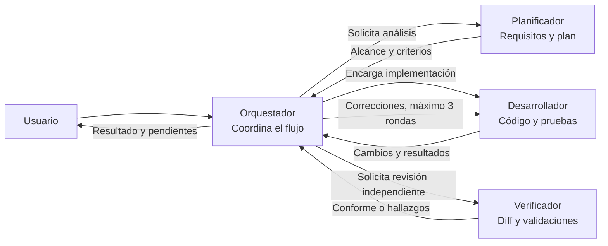
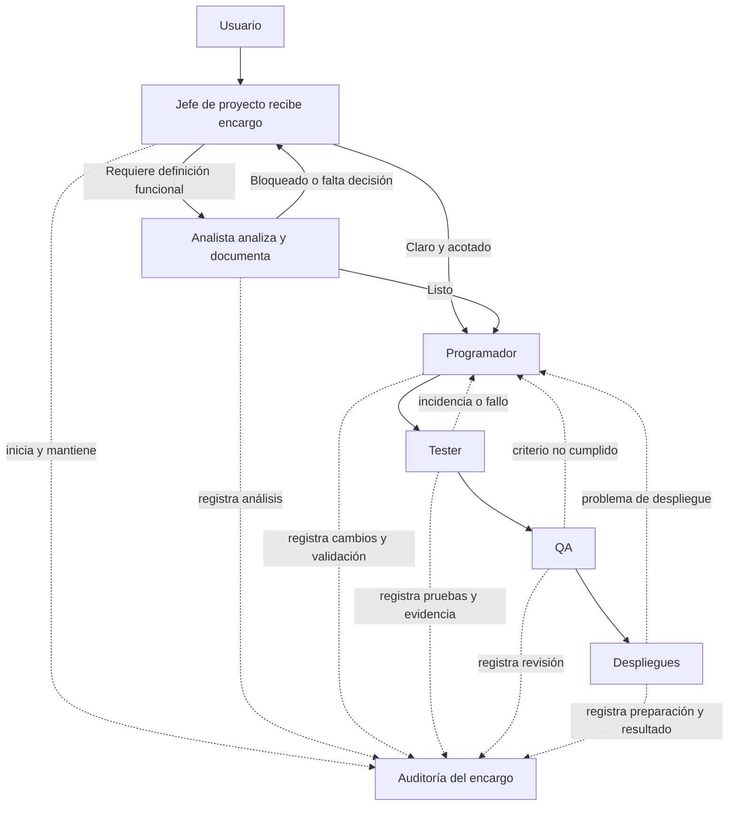
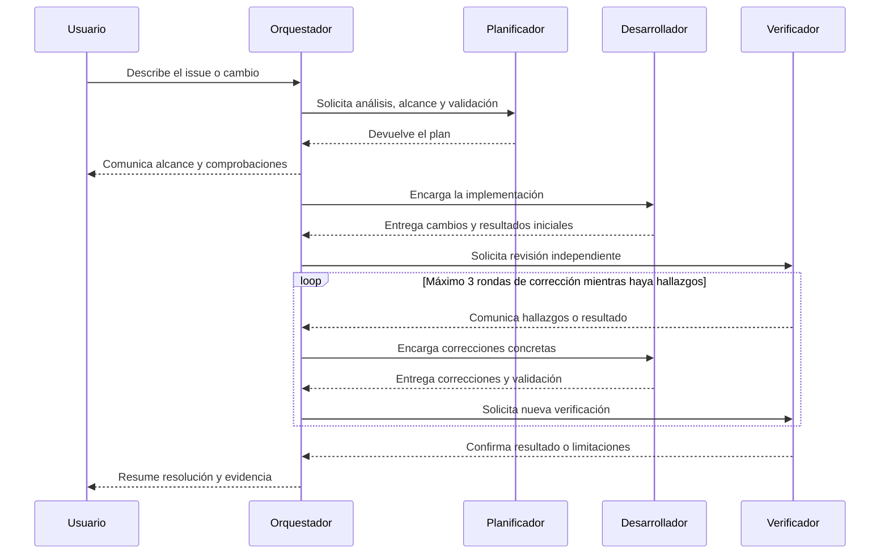

# Plan de agentes

> **Control documental**
> Código de proyecto: `app-todolist-260928`
> Fecha de actualización: `2026-09-29`
> Versión: `18`

Documento inicial para identificar y planificar los agentes que pueden participar en el desarrollo y la validación del proyecto.

## Agentes previstos

| Agente | Propósito inicial | Estado |
|---|---|---|
| Analista | Analizar encargos, registrar hallazgos y traspasos en la auditoría y derivar al Programador o devolver bloqueos. | Implementado |
| Programador | Implementar el alcance, incluir pruebas y dejar cambios y validaciones registrados. | Implementado |
| Tester | Ejecutar pruebas automatizadas y E2E con Playwright, registrar evidencia y trasladar fallos. | Implementado |
| QA | Verificar criterios y evidencias, registrar hallazgos y traspasar resultados. | Implementado |
| Despliegues | Revisar la preparación, registrar verificaciones y devolver problemas al Programador. | Implementado |
| Jefe de proyecto | Priorizar, elegir la vía de asignación e iniciar y mantener la auditoría del encargo. | Implementado |

## Equipo para resolver issues

| Agente | Propósito inicial | Estado |
|---|---|---|
| Orquestador | Coordinar el flujo y delegar planificación, implementación y verificación. | Implementado |
| Planificador | Analizar el encargo y concretar alcance, archivos, criterios y comprobaciones. | Implementado |
| Desarrollador | Implementar el cambio acordado con pruebas y documentación pertinentes. | Implementado |
| Verificador | Revisar de forma independiente los cambios y ejecutar comprobaciones enfocadas. | Implementado |

## Agentes locales del proyecto

Los cuatro perfiles están definidos en `.github/agents/` y solo están disponibles como personalizaciones de este workspace:

| Perfil | Archivo | Responsabilidad y límites |
|---|---|---|
| Orquestador | `.github/agents/orquestador.agent.md` | Dirige el ciclo completo e invoca a los otros tres agentes. No edita ni ejecuta comandos directamente. |
| Planificador | `.github/agents/planificador.agent.md` | Consulta requisitos y código para entregar un plan verificable. No implementa ni modifica archivos. |
| Desarrollador | `.github/agents/desarrollador.agent.md` | Implementa únicamente el alcance acordado, añade/ajusta pruebas y documentación y ejecuta validaciones enfocadas. No inicia servidores ni watchers. |
| Verificador | `.github/agents/verificador.agent.md` | Inspecciona el diff y ejecuta pruebas pertinentes sin editar archivos ni iniciar servidores o watchers. |

Para iniciar el flujo, selecciona **Orquestador** en el selector de agentes de GitHub Copilot Chat y describe el issue o cambio. También se puede seleccionar cada perfil por separado para pedir únicamente planificación, implementación o verificación.

El orquestador solicita primero un plan, lo comunica antes de implementar y después encarga una revisión independiente. Si el verificador encuentra defectos concretos, el orquestador los devuelve al desarrollador; el ciclo de corrección y verificación tiene un máximo de tres rondas. Si falta un requisito o hay una decisión pendiente que impide avanzar, debe detenerse y pedir aclaración en lugar de inventar una regla.

Los agentes siguen `.github/copilot-instructions.md` y la documentación del proyecto. El desarrollador conserva la responsabilidad de incluir pruebas con cada funcionalidad; el verificador informa qué comandos ejecutó y sus resultados, sin declarar validaciones que no haya realizado.

## Jefe de proyecto

| Perfil | Archivo | Responsabilidad y límites |
|---|---|---|
| Jefe de proyecto | `.github/agents/jefe-proyecto.agent.md` | Consulta el estado, prioriza el trabajo, mantiene `docs/cuadro-mando.html` e inicia y mantiene una auditoría por encargo. Decide la vía directa al Programador o la vía de análisis previo. No implementa código ni modifica issues. |

El cuadro de mando [`docs/cuadro-mando.html`](cuadro-mando.html) es un HTML autocontenido (sin recursos externos) que se abre en el navegador. Muestra el semáforo general, KPIs, avance por fases, cola de prioridades con la siguiente acción, alertas, gráficos de issues y pruebas, historias de usuario, actividad reciente y estado de los agentes. Todos los indicadores se calculan a partir de un único bloque JSON (`datos-proyecto`), que es lo único que el agente actualiza; cada actualización incrementa `meta.version`.

La priorización aplica, en orden: bloqueantes de calidad, criterios de salida de la fase en curso, dependencias, coherencia del seguimiento y mejoras. Los elementos que requieren una decisión no documentada se marcan como bloqueados sin resolverla.

El Jefe de proyecto decide la vía de comunicación según la claridad del encargo. Si objetivo y criterios están definidos, puede asignarlo directamente al Programador. Si hace falta precisar requisitos, reglas o criterios, lo asigna primero al Analista; este prepara el informe y, si queda listo, encarga al Programador la implementación. Si el análisis está bloqueado, el Analista devuelve la decisión pendiente al Jefe. El flujo es independiente del equipo de resolución de issues y no invoca al Orquestador ni a sus agentes.

## Analista

| Perfil | Archivo | Responsabilidad y límites |
|---|---|---|
| Analista | `.github/agents/analista.agent.md` | Analiza encargos que requieren definición funcional y crea `docs/analisis-encargo-<identificador-corto>.md`. Registra su intervención en la auditoría; si queda listo, encarga el trabajo al Programador; si está bloqueado, vuelve al Jefe. |

Cada informe de análisis tiene control documental propio. El Analista distingue hechos de hipótesis y devuelve al Jefe de proyecto la ruta del informe y el resultado de las etapas posteriores.

## Programador, Tester, QA y Despliegues

| Perfil | Archivo | Responsabilidad y límites |
|---|---|---|
| Programador | `.github/agents/programador.agent.md` | Implementa el alcance, registra cambios y validaciones en la auditoría y entrega al Tester. No inicia servidores ni watchers. |
| Tester | `.github/agents/tester.agent.md` | Ejecuta Vitest y flujos E2E con Playwright, registra evidencia en la auditoría, devuelve fallos al Programador y pasa resultados conformes a QA. No edita código ni pruebas. |
| QA | `.github/agents/qa.agent.md` | Revisa criterios y evidencias, registra hallazgos en la auditoría; devuelve incumplimientos al Programador o pasa resultados conformes a Despliegues. |
| Despliegues | `.github/agents/despliegues.agent.md` | Revisa preparación y registra verificaciones en la auditoría; devuelve problemas al Programador. No despliega recursos sin autorización. |

Los permisos de delegación de cada perfil reflejan el flujo general y sus retornos; no habilitan a estos agentes para invocar el Orquestador ni al equipo de resolución de issues.

## Auditoría del flujo general

Cada encargo iniciado por el Jefe de proyecto tiene un registro vivo en `docs/auditoria-flujo-general-<identificador-corto>.md`. El identificador procede del issue cuando existe; en otro caso, se deriva del encargo y se comprueba que no sobrescriba otro registro. No se crea una auditoría de ejemplo antes de que exista un encargo real.

El Jefe crea la auditoría en versión `1`, registra el encargo, las fuentes iniciales y la vía elegida, y comparte su ruta en cada delegación. Cada agente que interviene añade, antes del siguiente traspaso, una entrada cronológica con encargo recibido, actuación, resultado, artefactos/rutas, comandos y resultados reales, decisiones, bloqueos, limitaciones y siguiente responsable. La versión documental aumenta en una unidad por entrada y la fecha se actualiza conforme a la skill `versionado-documental`.

La auditoría incluye un diagrama Mermaid que representa la ruta realmente seguida: asignación directa o análisis previo, bloqueos, pasos completados, rondas de corrección y traspasos. Se actualiza junto con cada nueva entrada; las pruebas propuestas o validaciones pendientes se etiquetan como tales y nunca como completadas. El registro documenta el proceso, pero no sustituye los criterios de aceptación ni la decisión de cierre del usuario.

## Relación entre los agentes

### Equipo de resolución de issues

El Orquestador coordina a los otros tres agentes. Los resultados y hallazgos pasan por él, de modo que mantiene el alcance y dirige las correcciones.

### Relación entre los roles generales

El siguiente diagrama muestra las dos rutas de comunicación que decide el Jefe de proyecto:

## Flujo de resolución de un issue

Este diagrama representa la colaboración del equipo especializado desde la recepción del issue hasta su verificación y cierre. El ciclo de corrección y verificación se repite hasta que la solución sea válida, con un máximo de tres rondas:

## Estado y próximos pasos

El equipo especializado para resolver issues y los seis perfiles del flujo general están configurados y disponibles en el workspace; la primera versión del cuadro de mando se generó el 2026-09-29. La primera ejecución real servirá para comprobar la cadena y los retornos entre etapas. Las pruebas manuales de aceptación y SonarQube siguen pendientes según la documentación del MVP.

## Nota: recomendación de modelos

Recomendación orientativa según la complejidad habitual de cada rol. Los nombres son ejemplos; al configurar un perfil, elige la versión equivalente que esté disponible en el selector de modelos de GitHub Copilot. El esfuerzo indicado corresponde a `reasoning-effort`.

| Agente | Modelo recomendado | Esfuerzo | Motivo |
|---|---|---:|---|
| Jefe de proyecto | Claude Sonnet | Alto | Prioriza, interpreta evidencia y decide entre las dos rutas. |
| Analista | Claude Sonnet | Alto | Traza requisitos, detecta ambigüedades y formula criterios verificables. |
| Programador | GPT-5 | Alto | Implementa y corrige código con pruebas dentro del alcance acordado. |
| Tester | GPT-5 mini | Medio | Ejecuta pruebas y registra resultados; suele ser una labor procedimental. |
| QA | Claude Sonnet | Alto | Revisa de forma independiente; usar otra familia que la del Programador ayuda a reducir puntos ciegos compartidos. |
| Despliegues | Claude Sonnet | Medio | Revisa configuración y riesgos sin desplegar sin autorización. |
| Orquestador | GPT-5 | Alto | Coordina agentes, controla rondas y mantiene el alcance. |
| Planificador | Claude Sonnet | Medio-alto | Analiza requisitos, código y verificaciones sin implementar. |
| Desarrollador | GPT-5 | Alto | Implementa los cambios acordados y sus pruebas. |
| Verificador | Claude Sonnet | Alto | Revisa los cambios de forma independiente y con una familia distinta a la del Desarrollador. |
| Prompt Engineer | GPT-5 mini | Bajo-medio | Estructura y mejora prompts; normalmente no requiere el modelo de mayor coste. |
