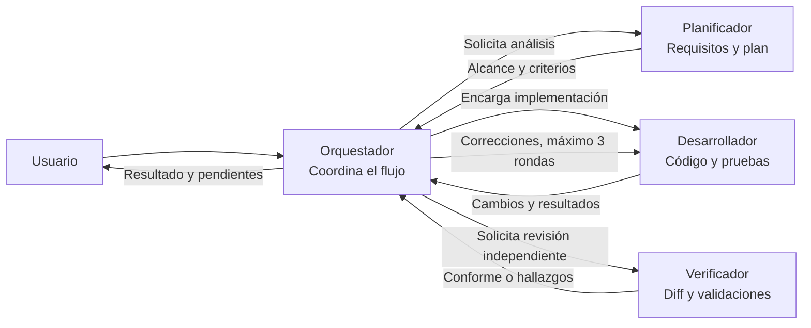
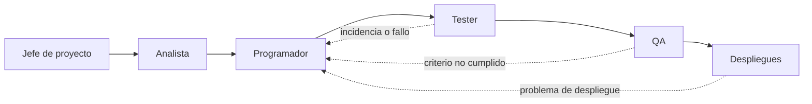
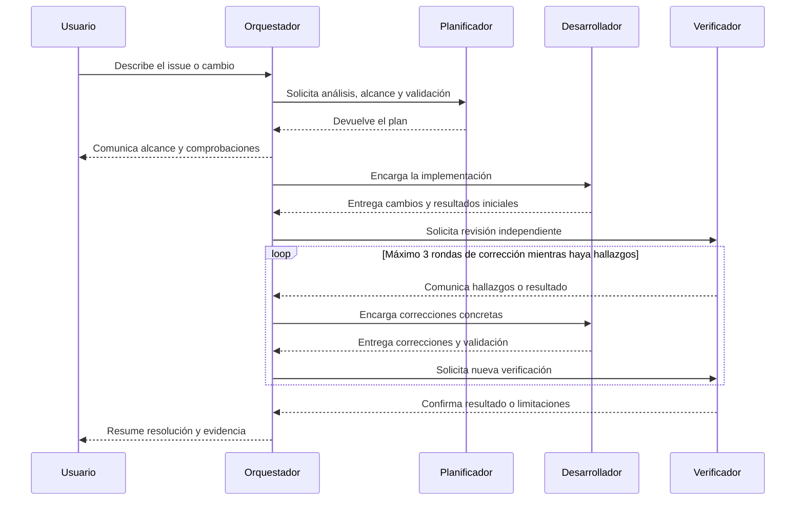

# Plan de agentes

> **Control documental**
> Código de proyecto: `app-todolist-260928`
> Fecha de actualización: `2026-09-29`
> Versión: `8`

Documento inicial para identificar y planificar los agentes que pueden participar en el desarrollo y la validación del proyecto.

## Agentes previstos

| Agente | Propósito inicial | Estado |
|---|---|---|
| Analista | Analizar requisitos, historias de usuario y criterios de aceptación. | Por definir |
| Programador | Diseñar e implementar los cambios necesarios en el código. | Por definir |
| Tester | Preparar y ejecutar pruebas para verificar el comportamiento del proyecto. | Por definir |
| QA | Verificar la calidad global del producto, los criterios de aceptación y los procesos de validación. | Por definir |
| Despliegues | Preparar, configurar y coordinar la puesta en marcha de la aplicación en los entornos previstos. | Por definir |
| Jefe de proyecto | Coordinar la planificación, el seguimiento y las decisiones del proyecto. | Por definir |

## Equipo para resolver issues

| Agente | Propósito inicial | Estado |
|---|---|---|
| Orquestador | Coordinar el flujo y delegar planificación, implementación y verificación. | Implementado |
| Planificador | Analizar el encargo y concretar alcance, archivos, criterios y comprobaciones. | Implementado |
| Desarrollador | Implementar el cambio acordado con pruebas y documentación pertinentes. | Implementado |
| Verificador | Revisar de forma independiente los cambios y ejecutar comprobaciones enfocadas. | Implementado |

## Agentes locales del proyecto

Los cuatro perfiles están definidos en `.github/agents/` y solo están disponibles como personalizaciones de este workspace:

| Perfil | Archivo | Responsabilidad y límites |
|---|---|---|
| Orquestador | `.github/agents/orquestador.agent.md` | Dirige el ciclo completo e invoca a los otros tres agentes. No edita ni ejecuta comandos directamente. |
| Planificador | `.github/agents/planificador.agent.md` | Consulta requisitos y código para entregar un plan verificable. No implementa ni modifica archivos. |
| Desarrollador | `.github/agents/desarrollador.agent.md` | Implementa únicamente el alcance acordado, añade/ajusta pruebas y documentación y ejecuta validaciones enfocadas. No inicia servidores ni watchers. |
| Verificador | `.github/agents/verificador.agent.md` | Inspecciona el diff y ejecuta pruebas pertinentes sin editar archivos ni iniciar servidores o watchers. |

Para iniciar el flujo, selecciona **Orquestador** en el selector de agentes de GitHub Copilot Chat y describe el issue o cambio. También se puede seleccionar cada perfil por separado para pedir únicamente planificación, implementación o verificación.

El orquestador solicita primero un plan, lo comunica antes de implementar y después encarga una revisión independiente. Si el verificador encuentra defectos concretos, el orquestador los devuelve al desarrollador; el ciclo de corrección y verificación tiene un máximo de tres rondas. Si falta un requisito o hay una decisión pendiente que impide avanzar, debe detenerse y pedir aclaración en lugar de inventar una regla.

Los agentes siguen `.github/copilot-instructions.md` y la documentación del proyecto. El desarrollador conserva la responsabilidad de incluir pruebas con cada funcionalidad; el verificador informa qué comandos ejecutó y sus resultados, sin declarar validaciones que no haya realizado.

## Relación entre los agentes

### Equipo de resolución de issues

El Orquestador coordina a los otros tres agentes. Los resultados y hallazgos pasan por él, de modo que mantiene el alcance y dirige las correcciones.

### Relación entre los roles generales

El siguiente diagrama muestra las principales etapas del ciclo general de trabajo:

## Flujo de resolución de un issue

Este diagrama representa la colaboración del equipo especializado desde la recepción del issue hasta su verificación y cierre. El ciclo de corrección y verificación se repite hasta que la solución sea válida, con un máximo de tres rondas:

## Estado y próximos pasos

El equipo especializado para resolver issues está configurado y disponible en el workspace. Su primera ejecución real servirá para comprobar el flujo con un issue del proyecto; las pruebas manuales de aceptación y SonarQube siguen pendientes según la documentación del MVP.
